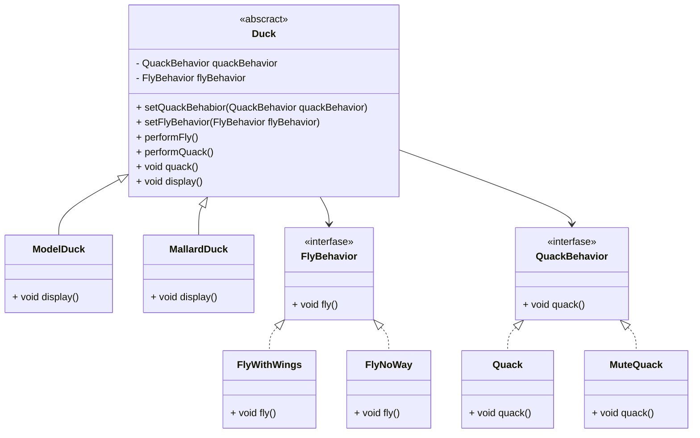

## 전략패턴
 알고리즘 군을 정의하고 캡슐화해서 각각의 알고리즘군을 수정하여 사용할 수 있다.

### 디자인 원칙
- 애플리케이션에서 달라지는 부분을 찾아내고, 달라지지 않는 부분과 분리한다.
    - 달라지는 부분을 찾아내 나머지 코드에 영향을 주지 않도록 '캡슐화'
- 구현보다는 인터페이스에 맞춰서 프로그래밍 한다.
- 상속보다는 구성을 활용한다.
 

